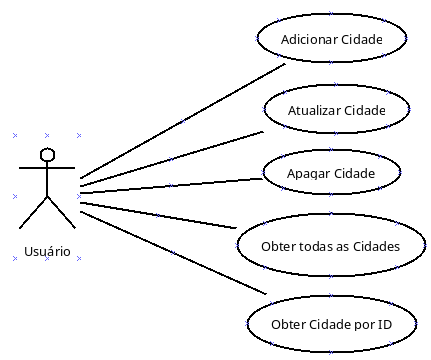
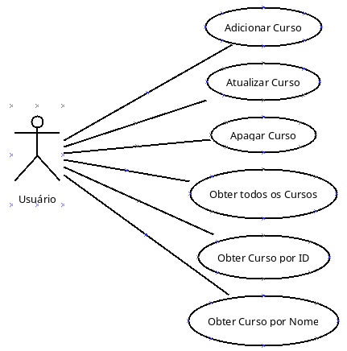
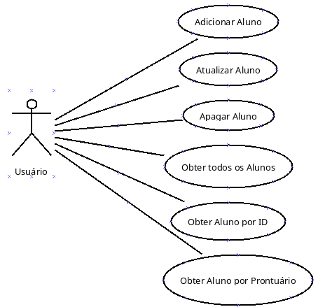
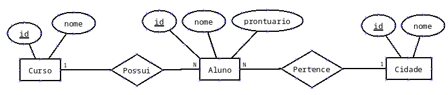
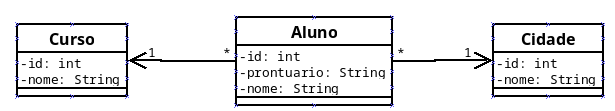
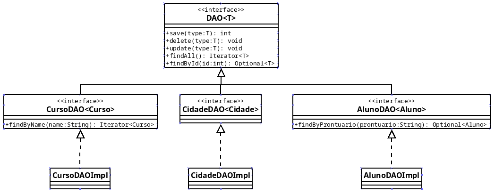

# Projeto Exemplo_DAO
Este projeto em Java tem fins didáticos e demonstra como realizar a persistência de dados utilizando o banco de dados SQLite. 

A estrutura do sistema segue a separação entre camadas de dados, regras de negócio e apresentação. 

O padrão **DAO (__Data Access Object__)** é aplicado com interfaces genéricas e específicas, e suas respectivas implementações concretas. 

A classe **ConnectionFactory** é responsável pela criação centralizada das conexões com o banco. 

O projeto também utiliza a classe **Optional** para representar valores que podem estar ausentes e conta com uma **exceção personalizada** (EntityAlreadyExistsException) para tratar tentativas de inserção duplicada.

---
# Casos de Uso 

## Domínio: Cidade

### Caso de Uso: Adicionar Cidade
**Ator Principal:** Usuário  
**Descrição:** Permite que o usuário adicione uma nova cidade ao sistema.  
**Fluxo Principal:**
1. O usuário informa o nome da cidade
2. A cidade é adicionada ao banco de dados.
3. O sistema confirma a adição.  
**Exceções:**
- Se o nome da cidade for nulo ou consistir apenas em espaços em branco, o sistema não adicionará a cidade e informará ao usuário que o nome da cidade não pode estar vazio.

### Caso de Uso: Atualizar Cidade
**Ator Principal:** Usuário  
**Descrição:** Permite que o usuário atualize as informações de uma cidade já cadastrada.  
**Fluxo Principal:**
1. O usuário informa qual cidade deseja atualizar, junto com novos dados.
2. O sistema localiza a cidade correspondente.
3. O sistema atualiza os dados no banco.
4. O sistema confirma a atualização.  
**Exceções:**
- Se o ID informado não corresponder a nenhuma cidade, uma mensagem de erro é exibida.
- Se o novo nome da cidade for nulo ou consistir apenas em espaços em branco, o sistema não atualizará a cidade e informará ao usuário que o nome da cidade não pode estar vazio.

### Caso de Uso: Apagar Cidade
**Ator Principal:** Usuário  
**Descrição:** Permite que o usuário remova uma cidade cadastrada.  
**Fluxo Principal:**
1. O usuário informa a cidade a ser removida.
2. O sistema verifica a existência da cidade.
3. A cidade é removida do banco de dados.
4. O sistema confirma a remoção.  
**Exceções:**
- Se a cidade informada não for localizada, uma mensagem de erro é exibida.
- Se a cidade estiver vinculada a outros dados, a exclusão pode ser impedida.

### Caso de Uso: Obter Todas as Cidades
**Ator Principal:** Usuário  
**Descrição:** Permite visualizar todas as cidades cadastradas.  
**Fluxo Principal:**
1. O usuário solicita a listagem de cidades.
2. O sistema consulta o banco de dados.
3. Todas as cidades cadastradas são exibidas.

### Caso de Uso: Obter Cidade por ID
**Ator Principal:** Usuário  
**Descrição:** Permite buscar uma cidade específica a partir de seu ID.  
**Fluxo Principal:**
1. O usuário informa o ID da cidade.
2. O sistema busca a cidade correspondente.
3. Os dados da cidade são exibidos.  
**Exceções:**
- Se o ID não existir, o sistema informa que a cidade não foi encontrada.

---

## Domínio: Curso

### Caso de Uso: Adicionar Curso
**Ator Principal:** Usuário  
**Descrição:** Permite que o usuário adicione um novo curso ao sistema.  
**Fluxo Principal:**
1. O usuário fornece o nome do curso.
2. O curso é adicionado ao banco de dados.
3. O sistema confirma a adição.  
**Exceções:**
- Se o nome do curso for nulo ou consistir apenas em espaços em branco, o sistema não adicionará o curso e informará ao usuário que o nome do curso não pode estar vazio.

### Caso de Uso: Atualizar Curso
**Ator Principal:** Usuário  
**Descrição:** Permite atualizar os dados de um curso existente.  
**Fluxo Principal:**
1. O usuário informa o curso e os novos dados.
2. O sistema localiza o curso correspondente.
3. Os dados são atualizados no banco.
4. O sistema confirma a atualização.  
**Exceções:**
- Se o curso informado não for encontrado, o sistema exibe uma mensagem de erro.
- Se o nome do curso for nulo ou consistir apenas em espaços em branco, o sistema não adicionará o curso e informará ao usuário que o nome do curso não pode estar vazio.

### Caso de Uso: Apagar Curso
**Ator Principal:** Usuário  
**Descrição:** Permite que o usuário remova um curso cadastrado.  
**Fluxo Principal:**
1. O usuário informa o curso a ser removido.
2. O sistema verifica a existência do curso.
3. O curso é excluído do banco.
4. O sistema confirma a exclusão.  
**Exceções:**
- Se o curso informado não for localizado, uma mensagem de erro é exibida.
- Se o curso estiver vinculado a outros dados, a exclusão pode ser impedida.

### Caso de Uso: Obter Todos os Cursos
**Ator Principal:** Usuário  
**Descrição:** Permite listar todos os cursos cadastrados no sistema.  
**Fluxo Principal:**
1. O usuário solicita a listagem.
2. O sistema consulta o banco de dados.
3. Todos os cursos cadastrados são exibidos.

### Caso de Uso: Obter Curso por ID
**Ator Principal:** Usuário  
**Descrição:** Permite consultar um curso pelo ID.  
**Fluxo Principal:**
1. O usuário informa o ID do curso.
2. O sistema busca o curso correspondente.
3. Os dados do curso são exibidos.  
**Exceções:**
- Se o ID não corresponder a nenhum curso, o sistema informa que o curso não foi encontrado.

### Caso de Uso: Obter Curso por Nome
**Ator Principal:** Usuário  
**Descrição:** Permite buscar cursos com base no nome.  
**Fluxo Principal:**
1. O usuário informa o nome do curso (ou parte dele).
2. O sistema realiza a busca no banco.
3. Cursos com o nome correspondente são exibidos.  
**Exceções:**
- Se nenhum curso for encontrado, o sistema informa que não houve resultados.

---

## Domínio: Aluno

### Caso de Uso: Adicionar Aluno
**Ator Principal:** Usuário  
**Descrição:** Permite que o usuário adicione um novo aluno ao sistema.  
**Fluxo Principal:**
1. O usuário informa os dados do aluno: nome, prontuário, curso, cidade.
2. O sistema verifica se já existe um aluno com o mesmo prontuário.
3. Se não existir, o aluno é salvo no banco de dados.
4. O sistema confirma a adição.  
**Exceções:**
- Se já existir um aluno com o mesmo prontuário, é lançada a `EntityAlreadyExistsException`.
- Se algum campo for nulo ou consistir apenas de espaço em branco, o sistema não adicionará o aluno e informará ao usuário.

### Caso de Uso: Atualizar Aluno
**Ator Principal:** Usuário  
**Descrição:** Permite atualizar os dados de um aluno já cadastrado.  
**Fluxo Principal:**
1. O usuário informa o aluno e os novos dados.
2. O sistema localiza o aluno correspondente.
3. Os dados são atualizados no banco.
4. O sistema confirma a atualização.  
**Exceções:**
- Se o aluno informado não existir, o sistema exibe uma mensagem de erro.
- Se já existir um aluno com o mesmo prontuário, é lançada a `EntityAlreadyExistsException`.
- Se algum campo for nulo ou consistir apenas de espaço em branco, o sistema não adicionará o aluno e informará ao usuário.

### Caso de Uso: Apagar Aluno
**Ator Principal:** Usuário  
**Descrição:** Permite excluir um aluno do sistema.  
**Fluxo Principal:**
1. O usuário informa o aluno.
2. O sistema verifica se o aluno existe.
3. O aluno é removido do banco de dados.
4. O sistema confirma a exclusão.  
**Exceções:**
- Se o aluno não existir, o sistema informa que o aluno não foi encontrado.

### Caso de Uso: Obter Todos os Alunos
**Ator Principal:** Usuário  
**Descrição:** Permite listar todos os alunos cadastrados.  
**Fluxo Principal:**
1. O usuário solicita a listagem de alunos.
2. O sistema consulta o banco de dados.
3. Todos os alunos cadastrados são exibidos.

### Caso de Uso: Obter Aluno por ID
**Ator Principal:** Usuário  
**Descrição:** Permite consultar um aluno específico a partir do seu ID.  
**Fluxo Principal:**
1. O usuário informa o ID do aluno.
2. O sistema busca o aluno no banco de dados.
3. Os dados do aluno são exibidos.  
**Exceções:**
- Se o ID não existir, o sistema informa que o aluno não foi encontrado.

### Caso de Uso: Obter Aluno por Prontuário
**Ator Principal:** Usuário  
**Descrição:** Permite buscar um aluno com base no seu prontuário.  
**Fluxo Principal:**
1. O usuário informa o prontuário.
2. O sistema busca o aluno correspondente.
3. Os dados do aluno são exibidos.  
**Exceções:**
- Se o prontuário não existir, o sistema informa que nenhum aluno foi encontrado.

---

# Diagrama Entidade-Relacionamento (DER)

---

# Diagrama de Classes

---

# Camada de Dados 
