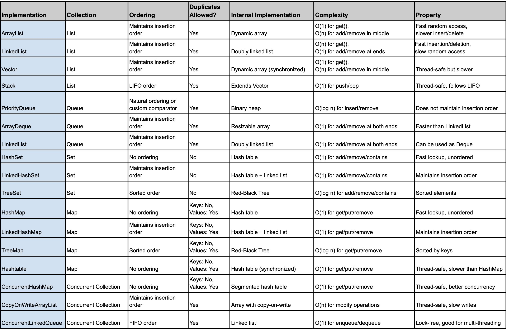

# API Collections

Em Java, a API Collections é um conjunto de classes e interfaces que  
fornecem uma maneira de armazenar, acessar e manipular dados de forma eficiente. 
A API Collections fornece implementações de estruturas de dados como listas, conjuntos, mapas, filas e pilhas, 
e define as operações que podem ser realizadas sobre esses tipos de dados.

### Principais Interfaces da API Collections
* Collection: A interface raiz de todas as coleções no Java. 
Ela define métodos fundamentais para manipulação de dados em coleções, como `add()`, `remove()`, `size()`, `isEmpty()`, entre outros. 
Outras interfaces e classes de coleções herdam dessa interface.

* List: Uma subinterface de Collection que representa uma coleção ordenada, ou seja, em que a ordem dos elementos é mantida. 
Ela permite elementos duplicados.

* Set: Também uma subinterface de Collection, mas difere de List no fato de que não permite elementos duplicados.

* Queue: Interface que representa uma coleção de elementos organizada de forma a permitir a inserção de novos elementos no final e a remoção do primeiro elemento, seguindo a política FIFO (First In, First Out).

* Map: Embora não seja uma subinterface de Collection, é uma interface fundamental para a API de coleções.
Ela representa uma coleção de pares chave-valor, onde cada chave é única e mapeia para um único valor.

### Principais Implementações da API Collections
* ArrayList: Uma lista que usa um array dinâmico para armazenar os elementos. É a implementação de List mais utilizada devido à sua eficiência para acesso aleatório (via índice).
```java
List<String> list = new ArrayList<>();
list.add("Java");
list.add("Python");
list.add("C++");
```

* LinkedList: Uma implementação de List e Queue, que usa uma estrutura de dados baseada em nós duplamente encadeados. É mais eficiente que o ArrayList para inserções e remoções, especialmente no início e no meio da lista.
```java
List<String> linkedList = new LinkedList<>();
linkedList.add("Java");
linkedList.add("Python");
```

* HashSet: Uma implementação de Set baseada em uma tabela hash. Ele não permite elementos duplicados e a ordem de inserção não é garantida
```java
Set<String> set = new HashSet<>();
set.add("Java");
set.add("Python");
set.add("C++");
```

* TreeSet: Uma implementação de Set que mantém os elementos ordenados, utilizando uma árvore binária balanceada (como um Red-Black Tree).
```java
Set<String> treeSet = new TreeSet<>();
treeSet.add("Java");
treeSet.add("Python");
treeSet.add("C++");
```

* HashMap: Uma implementação de Map que usa uma tabela hash para armazenar os pares chave-valor. A chave deve ser única.
```java
Map<String, Integer> map = new HashMap<>();
map.put("Java", 1);
map.put("Python", 2);
```


### Outros Componentes da API Collections
#### Collections
A classe Collections fornece métodos estáticos que operam em coleções, como ordenação, busca e reversão.
* `sort(List<T> list)`: Ordena uma lista.
* `reverse(List<?> list)`: Inverte a ordem de uma lista.
* `max(Collection<? extends T> coll)`: Retorna o maior elemento da coleção.
* `min(Collection<? extends T> coll)`: Retorna o menor elemento da coleção
* `frequency(Collection<?> coll, Object o)`: Retorna a quantidade de vezes que o elemento o aparece na coleção.
* `fill(List<? super T> list, T obj)`: Preenche toda a lista com o valor especificado.
* `replaceAll(List<T> list, T oldVal, T newVal)`: Substitui todas as ocorrências de oldVal por newVal na lista.
* `shuffle(List<?> list)`: Embaralha aleatoriamente os elementos da lista
* `copy(List<? super T> dest, List<? extends T> src)`:  Copia os elementos de uma lista para outra. A lista de destino precisa ser do mesmo tamanho ou maior que a lista de origem.


```java
import java.util.*;

public class Main {
    public static void main(String[] args) {
        // Criando uma lista com números
        List<Integer> numbers = new ArrayList<>(Arrays.asList(3, 1, 4, 1, 5));
        
        // Ordenando a lista
        Collections.sort(numbers);  // Ordena a lista em ordem crescente
        System.out.println("Ordenada: " + numbers);
        
        // Invertendo a lista
        Collections.reverse(numbers);  // Inverte a lista
        System.out.println("Invertida: " + numbers);
        
        // Encontrando o maior e o menor elemento
        Integer max = Collections.max(numbers);  // Encontrar o maior elemento
        Integer min = Collections.min(numbers);  // Encontrar o menor elemento
        System.out.println("Maior: " + max);
        System.out.println("Menor: " + min);
        
        // Verificando a frequência de um elemento
        int frequency = Collections.frequency(numbers, 1);  // Contar quantas vezes o '1' aparece
        System.out.println("Frequência do '1': " + frequency);
        
        // Preenchendo todos os elementos com um valor específico
        Collections.fill(numbers, 0);  // Preenche toda a lista com '0'
        System.out.println("Lista preenchida com 0: " + numbers);
        
        // Substituindo o valor de um elemento
        Collections.replaceAll(numbers, 0, 9);  // Substitui todos os '0' por '9'
        System.out.println("Lista após substituir 0 por 9: " + numbers);
        
        // Embaralhando a lista
        Collections.shuffle(numbers);  // Embaralha os elementos da lista
        System.out.println("Lista embaralhada: " + numbers);
        
        // Copiando uma lista para outra
        List<Integer> copiedList = new ArrayList<>(numbers.size());
        Collections.copy(copiedList, numbers);  // Copia os elementos de numbers para copiedList
        System.out.println("Lista copiada: " + copiedList);
    }
}
```
#### Iterator
 A interface **Iterator** permite percorrer os elementos de uma coleção de forma sequencial. Ele fornece os métodos hasNext() e next() para iterar sobre os elementos.

```java
 List<Integer> numbers = new ArrayList<>(Arrays.asList(3, 1, 4, 1, 5));
Iterator<String> iterator = numbers.iterator();
while (iterator.hasNext()) {
    System.out.println(iterator.next());
}

```

#### Comparable e Comparator
A interface **Comparable** é usada para definir a ordem natural dos elementos de uma classe. 
Se você quiser que os objetos de uma classe sejam comparáveis e possam ser ordenados automaticamente (como usando Collections.sort() ou Arrays.sort()), você deve implementar essa interface.
O único método de Comparable é:

`int compareTo(T o)`: Compara o objeto atual com o objeto passado como parâmetro. O retorno pode ser:
*    < 0: Se o objeto atual for "menor" que o objeto passado.
*    0: Se o objeto atual for igual ao objeto passado.
*    \> 0: Se o objeto atual for "maior" que o objeto passado.

Suponha que você tenha uma classe Pessoa e queira ordenar uma lista de pessoas pela idade
```java
import java.util.*;

public class Pessoa implements Comparable<Pessoa> {
    String nome;
    int idade;

    public Pessoa(String nome, int idade) {
        this.nome = nome;
        this.idade = idade;
    }

    // Implementação do compareTo para comparar as idades
    @Override
    public int compareTo(Pessoa outraPessoa) {
        return Integer.compare(this.idade, outraPessoa.idade);
    }

    @Override
    public String toString() {
        return nome + " (" + idade + ")";
    }
}

public class Main {
    public static void main(String[] args) {
        List<Pessoa> pessoas = new ArrayList<>();
        pessoas.add(new Pessoa("João", 30));
        pessoas.add(new Pessoa("Maria", 25));
        pessoas.add(new Pessoa("Carlos", 35));

        // Ordenando a lista de pessoas pela idade
        Collections.sort(pessoas);

        // Exibindo a lista ordenada
        System.out.println(pessoas);
    }
}
```

Implementação interna das estruturas de dados disponíveis:


