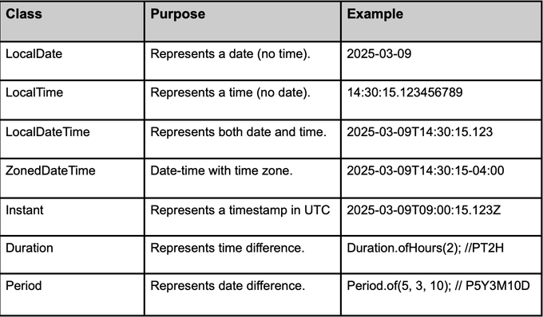

# API Date/Time

A API Date/Time do Java, introduzida no Java 8 através do pacote java.time,
representa uma revolução na forma como lidamos com datas e horas. Ela foi projetada para ser imutável, thread-safe e muito mais intuitiva, 
além de oferecer suporte completo para diferentes fusos horários e calendários. O design da API segue o padrão do ISO 8601, que é um formato internacionalmente aceito para representação de datas e horários.

### Principais Classes da API Date/Time do Java 8:
* **LocalDate**: Representa uma data (sem hora, sem fuso horário).
```java
import java.time.LocalDate;

public class ExemploLocalDate {
    public static void main(String[] args) {
        // Obtém a data atual
        LocalDate hoje = LocalDate.now();
        System.out.println("Hoje: " + hoje);

        // Representa uma data específica
        LocalDate aniversario = LocalDate.of(1995, 7, 15);
        System.out.println("Aniversário: " + aniversario);

        // Comparação de datas
        boolean ehMaior = aniversario.isAfter(hoje);
        System.out.println("Aniversário é depois de hoje? " + ehMaior);
    }
}
```

* **LocalTime**: Representa uma hora do dia (sem data, sem fuso horário).
```java
import java.time.LocalTime;

public class ExemploLocalTime {
    public static void main(String[] args) {
        // Obtém a hora atual
        LocalTime agora = LocalTime.now();
        System.out.println("Agora: " + agora);

        // Hora de um evento específico
        LocalTime evento = LocalTime.of(14, 30);  // 14:30
        System.out.println("Evento: " + evento);
    }
}
```

* **LocalDateTime**: Representa data e hora (sem fuso horário).
```java
import java.time.LocalDateTime;

public class ExemploLocalDateTime {
    public static void main(String[] args) {
        // Data e hora atuais
        LocalDateTime agora = LocalDateTime.now();
        System.out.println("Agora: " + agora);

        // Data e hora específicas
        LocalDateTime evento = LocalDateTime.of(2025, 3, 5, 14, 30);
        System.out.println("Evento: " + evento);
    }
}
```

* **ZonedDateTime**:  Representa uma data e hora com fuso horário
```java
import java.time.ZonedDateTime;
import java.time.ZoneId;

public class ExemploZonedDateTime {
    public static void main(String[] args) {
        // Obtém a data e hora no fuso horário atual
        ZonedDateTime agora = ZonedDateTime.now();
        System.out.println("Agora (fuso horário local): " + agora);

        // Data e hora em um fuso horário específico
        ZonedDateTime evento = ZonedDateTime.of(2025, 3, 5, 14, 30, 0, 0, ZoneId.of("America/Sao_Paulo"));
        System.out.println("Evento em São Paulo: " + evento);
    }
}
```

* **Instant**: Representa um ponto específico na linha do tempo (em segundos ou milissegundos desde o epoch (1970-01-01T00:00:00Z)).
Pode ser usado para representar um timestamp exato, como o momento de um evento (ideal para medições de tempo).
```java
import java.time.Instant;

public class ExemploInstant {
    public static void main(String[] args) {
        // Obtém o instante atual (timestamp)
        Instant agora = Instant.now();
        System.out.println("Agora (Instant): " + agora);

        // Manipulação de instantes
        Instant futuro = agora.plusSeconds(60);  // Um minuto depois
        System.out.println("Futuro: " + futuro);
    }
}
```
* **Duration e Period**: Duration é usada para medir intervalos de tempo (em segundos e nanosegundos).
Period é usada para medir intervalos de data (em anos, meses e dias).
```java
import java.time.*;

public class ExemploDurationPeriod {
    public static void main(String[] args) {
        // Usando Duration para intervalos de tempo
        Duration duracao = Duration.ofHours(5);
        System.out.println("Duração de 5 horas: " + duracao);

        // Usando Period para intervalos de datas
        LocalDate inicio = LocalDate.of(2020, 1, 1);
        LocalDate fim = LocalDate.of(2025, 3, 5);
        Period periodo = Period.between(inicio, fim);
        System.out.println("Período entre as datas: " + periodo);
    }
}
```

### Principais métodos de LocalDate
* `now()`: Retorna a data atual do sistema (sem hora).

```java
LocalDate hoje = LocalDate.now();
```

* `of(int ano, int mes, int dia)`: Cria uma instância de LocalDate com a data específica.
```java
LocalDate aniversario = LocalDate.of(1990, 12, 25);
```

* `plusX()` e `minusX()`: Adiciona ou subtrai unidades de tempo.
```java
LocalDate hoje = LocalDate.now();
LocalDate novaData = hoje.plusDays(10);  // Adiciona 10 dias
LocalDate dataSubtraida = hoje.minusMonths(2);  // Subtrai 2 meses
```

* `isBefore()`, `isAfter()`, `isEqual()`: Compara duas datas.
```java
LocalDate hoje = LocalDate.now();
boolean isBefore = hoje.isBefore(LocalDate.of(2025, 1, 1));
boolean isAfter = hoje.isAfter(LocalDate.of(2020, 1, 1));
```

* `getDayOfWeek()`: Obtém o dia da semana 
```java
LocalDate hoje = LocalDate.now();
DayOfWeek diaSemana = hoje.getDayOfWeek();
```

* `getMonth()`: Obtém o mês.
```java
LocalDate hoje = LocalDate.now();
Month mes = hoje.getMonth();
```

* `format(DateTimeFormatter formatter)`: Formata a data para uma string.
```java
LocalDate hoje = LocalDate.now();
DateTimeFormatter formatter = DateTimeFormatter.ofPattern("dd/MM/yyyy");
String dataFormatada = hoje.format(formatter);
```


### Principais métodos de LocalTime
* `now()`: Retorna a hora atual do sistema (sem data).

```java
LocalTime agora = LocalTime.now();
```

* `of(int hora, int minuto)`: Cria uma instância de LocalTime com a hora e o minuto especificados.
```java
LocalTime evento = LocalTime.of(14, 30);  // 14:30
```

* `plusX()` e `minusX()`: Adiciona ou subtrai unidades de tempo (minutos, horas, etc.).
```java
LocalTime agora = LocalTime.now();
LocalTime novaHora = agora.plusMinutes(15);  // Adiciona 15 minutos
LocalTime horaSubtraida = agora.minusHours(1);  // Subtrai 1 hora
```

* `isBefore()`, `isAfter()`, `isEqual()`: Compara duas horas.
```java
LocalTime agora = LocalTime.now();
boolean isAfter = agora.isAfter(LocalTime.of(12, 0));
```

### Principais métodos de LocalDateTime
* `now()`: Retorna a data e hora atual do sistema (sem fuso horário).
```java
LocalDateTime agora = LocalDateTime.now();
```

* `of(int ano, int mes, int dia, int hora, int minuto)`: Cria uma instância de LocalDateTime com data e hora específicas.
```java
LocalDateTime evento = LocalDateTime.of(2025, 3, 5, 14, 30);
```

* `plusX()` e `minusX()`: Adiciona ou subtrai unidades de tempo.
```java
LocalDateTime agora = LocalDateTime.now();
LocalDateTime futuro = agora.plusDays(10).plusHours(5);  // Adiciona 10 dias e 5 horas
```

* `isBefore()`, `isAfter()`, `isEqual()`: Compara datas e horas.
```java
LocalDateTime agora = LocalDateTime.now();
boolean isBefore = agora.isBefore(LocalDateTime.of(2025, 3, 5, 15, 30));
```

* `format(DateTimeFormatter formatter)`: Formata a data e hora em uma string.
```java
LocalDateTime agora = LocalDateTime.now();
DateTimeFormatter formatter = DateTimeFormatter.ofPattern("dd/MM/yyyy HH:mm");
String dataHoraFormatada = agora.format(formatter);
```

### Exemplo de Formatação e Parsing
```java
import java.time.LocalDate;
import java.time.format.DateTimeFormatter;

public class ExemploFormatacaoParsing {
    public static void main(String[] args) {
        // Formatando uma data
        LocalDate data = LocalDate.now();
        DateTimeFormatter formatter = DateTimeFormatter.ofPattern("dd/MM/yyyy");
        String dataFormatada = data.format(formatter);
        System.out.println("Data formatada: " + dataFormatada);

        // Convertendo uma string para LocalDate
        String dataString = "05/03/2025";
        LocalDate parsedDate = LocalDate.parse(dataString, formatter);
        System.out.println("Data analisada: " + parsedDate);
    }
}
```


