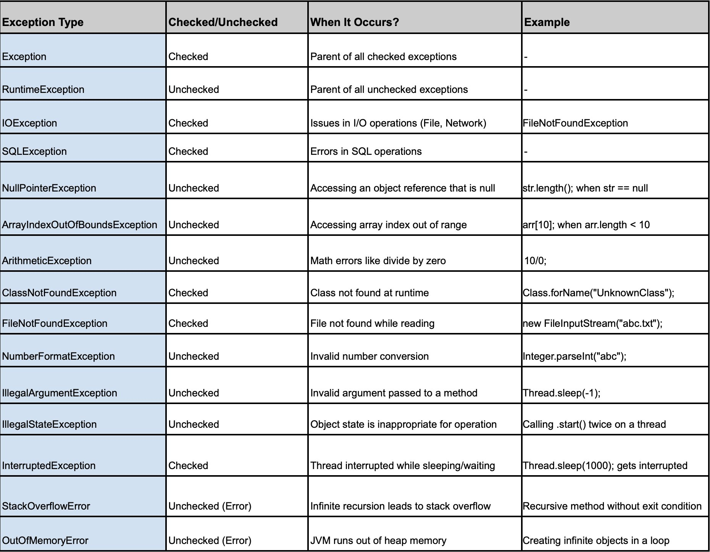

# Tratamento de Exceções
Em Java, o tratamento de exceções (_exception handling_) é um mecanismo robusto para lidar com erros em tempo de execução, garantindo que o programa não finalize abruptamente. O objetivo é permitir que o programa continue sua execução de forma controlada, mesmo diante de situações inesperadas.

Uma exceção é um evento que ocorre durante a execução de um programa e que interrompe o fluxo normal das instruções. Em Java, as exceções são objetos que herdam da classe **Throwable**.

O tratamento de exceções em Java é realizado por meio de um bloco especial de código que inclui as palavras-chave `try`, `catch`, `throw`, `throws` e `finally`.

### Exceções: Checked e Unchecked 
Em Java, as exceções podem ser divididas em dois tipos principais:
* Checked Exceptions (Exceções Verificadas): São exceções que devem ser tratadas pelo programador, seja com um bloco `try-catch` ou propagando a exceção para o método chamador utilizando a palavra-chave `throws`. Elas são subclasses de **Exception**, exceto RuntimeException e suas subclasses. O compilador exige que o código trate essas exceções ou declare que o método pode lançá-las.
Exemplos: **IOException**, **SQLException**.


* Unchecked Exceptions (Exceções Não Verificadas): São exceções que não precisam ser tratadas ou declaradas.
Elas são subclasses de **RuntimeException**, como **NullPointerException**, **ArrayIndexOutOfBoundsException**, etc.
O compilador não exige que essas exceções sejam tratadas ou declaradas.
Geralmente são causadas por falhas de lógica no código e podem ser evitadas com boas práticas de programação

**Exemplo 1: Tratando FileNotFoundException e IOException (checked)** 
<br>
A IOException é uma exceção mais geral que pode ser lançada quando ocorrem falhas de entrada/saída ao tentar ler ou escrever em arquivos, enquanto a FileNotFoundException é uma exceção específica lançada quando um arquivo não pode ser encontrado.

```java
import java.io.File;
import java.io.FileNotFoundException;
import java.io.IOException;
import java.util.Scanner;

public class ExemploFileNotFoundException {
    public static void main(String[] args) {
        // Caminho para o arquivo (que não existe)
        String caminhoArquivo = "arquivo.txt"; //Arquivo inexistente, para causar erro.
        Scanner scanner = null;  // Declara o scanner fora do bloco try para garantir o acesso no finally
        
        try {
            // Tentando abrir o arquivo
            File arquivo = new File(caminhoArquivo);
            scanner = new Scanner(arquivo);  // Vai lançar FileNotFoundException se o arquivo não for encontrado

            // Leitura do conteúdo do arquivo
            while (scanner.hasNextLine()) {
                String linha = scanner.nextLine();
                System.out.println(linha);
            }
            
        } catch (FileNotFoundException e) {
            // Tratamento da exceção caso o arquivo não seja encontrado
            System.out.println("Erro: O arquivo não foi encontrado.");
            e.printStackTrace();
            
        } catch (IOException e) {
            // Tratamento de outras exceções de entrada/saída
            System.out.println("Erro de entrada/saída ocorreu.");
            e.printStackTrace();
            
        } finally {
            // Bloco finalmente executado independentemente do que aconteça
            if (scanner != null) {
                scanner.close();  // Fecha o scanner para liberar o recurso
                System.out.println("Scanner fechado.");
            } else {
                System.out.println("O scanner não foi inicializado, então não foi possível fechar.");
            }
        }
    }
}
```


**Exemplo 2: Tratando NullPointerException (unchecked)** 
<br>
Neste exemplo, vamos tentar acessar o método length() de uma string que pode ser null, e trataremos a NullPointerException com um bloco try-catch.

```java
public class ExemploUnchecked {
    public static void main(String[] args) {
        String texto = null;
        
        try {
            // Tentando acessar um método em uma variável null
            System.out.println(texto.length());
        } catch (NullPointerException e) {
            // Tratando a exceção
            System.out.println("Erro: A variável texto é null, não é possível acessar o método length.");
        }
    }
}
```
**Exemplo 3: Tratando ArithmeticException (unchecked)**
<br>
Aqui, vamos dividir um número por zero, o que resultará em uma ArithmeticException, e tratá-la usando try-catch.

```java
public class ExemploUnchecked {
    public static void main(String[] args) {
        int divisor = 0;
        
        try {
            // Tentando dividir por zero
            int resultado = 10 / divisor;
            System.out.println("Resultado: " + resultado);
        } catch (ArithmeticException e) {
            // Tratando a exceção
            System.out.println("Erro: Não é possível dividir por zero.");
        }
    }
}
```

**Exemplo 4: Tratando ArrayIndexOutOfBoundsException (unchecked)**
<br>
Aqui, vamos acessar um índice inválido de um array, o que gerará uma ArrayIndexOutOfBoundsException, e tratá-la com try-catch.

```java
public class ExemploUnchecked {
    public static void main(String[] args) {
        int[] numeros = {1, 2, 3};
        
        try {
            // Tentando acessar um índice fora do limite do array
            System.out.println(numeros[5]);
        } catch (ArrayIndexOutOfBoundsException e) {
            // Tratando a exceção
            System.out.println("Erro: Índice fora dos limites do array.");
        }
    }
}
```

**Exemplo 5: Tratando várias exceções com try-catch (unchecked)**
<br>
Você também pode capturar várias exceções de diferentes tipos em um único bloco try-catch. Para isso, é possível usar múltiplos blocos catch ou capturar exceções mais gerais (como Exception ou RuntimeException), que englobam várias exceções.

```java
public class ExemploUnchecked {
    public static void main(String[] args) {
        String texto = null;
        int divisor = 0;
        int[] numeros = {1, 2, 3};
        
        try {
            // Tentando acessar um método em um objeto null
            System.out.println(texto.length());
            
            // Tentando dividir por zero
            int resultado = 10 / divisor;
            
            // Tentando acessar um índice fora do limite do array
            System.out.println(numeros[5]);
        } catch (NullPointerException e) {
            System.out.println("Erro: A variável texto é null.");
        } catch (ArithmeticException e) {
            System.out.println("Erro: Não é possível dividir por zero.");
        } catch (ArrayIndexOutOfBoundsException e) {
            System.out.println("Erro: Índice fora dos limites do array.");
        } catch (Exception e) {
            // Captura outras exceções gerais
            System.out.println("Erro: Ocorreu um erro inesperado.");
        }
    }
}
```




### Lançando Exceções
Em Java, você pode lançar exceções manualmente usando a palavra-chave throw. Isso pode ser útil quando você quer sinalizar um erro ou uma condição inesperada em um método.

```java
public class LancaExcecao {
    public static void validarIdade(int idade) {
        if (idade < 18) {
            throw new IllegalArgumentException("Idade não permitida. Deve ser maior ou igual a 18.");
        } else {
            System.out.println("Idade válida.");
        }
    }

    public static void main(String[] args) {
        try {
            validarIdade(16);
        } catch (IllegalArgumentException e) {
            System.out.println("Erro: " + e.getMessage());
        }
    }
}
```

Você pode declarar que um método pode lançar exceções usando a palavra-chave throws. Isso é comum em exceções verificadas (checked exceptions). Quando um método declara que pode lançar uma exceção, o chamador do método deve tratá-la ou propagá-la ainda mais para cima.

```java
import java.io.*;

public class ExemploThrows {
    public static void lerArquivo() throws IOException {
        FileReader arquivo = new FileReader("arquivo_inexistente.txt");
        BufferedReader br = new BufferedReader(arquivo);
        br.readLine();
        br.close();
    }

    public static void main(String[] args) {
        try {
            lerArquivo();
        } catch (IOException e) {
            System.out.println("Erro ao tentar ler o arquivo: " + e.getMessage());
        }
    }
}
```

### Exceções Personalizadas (_Custom Exceptions_) em Java
Exceções personalizadas em Java permitem que você crie seus próprios tipos de exceções para representar condições de erro específicas do seu aplicativo. Isso oferece maior clareza e controle sobre o tratamento de erros.

Imagine que você está desenvolvendo um sistema de cadastro de usuários e precisa validar o formato dos endereços de e-mail fornecidos. Você pode criar uma exceção personalizada para representar um e-mail inválido.


```java
public class EmailInvalidoException extends RuntimeException {

    public EmailInvalidoException(String message) {
        super(message);
    }

    public EmailInvalidoException(String message, Throwable cause) {
        super(message, cause);
    }
}
```

Classe para validar o email e lançar a exceção EmailInvalidoException quando necessário:
```java
public class ValidadorEmail {

    public static boolean validarEmail(String email) throws EmailInvalidoException {
        if (email == null || email.isEmpty() || !email.contains("@") || !email.contains(".")) {
            throw new EmailInvalidoException("Endereço de e-mail inválido: " + email);
        }
        return true;
    }

    public static void main(String[] args) {
        String email1 = "usuario@dominio.com";
        String email2 = "usuario.dominio";

        try {
            validarEmail(email1);
            System.out.println("E-mail válido: " + email1);

            validarEmail(email2);
            System.out.println("E-mail válido: " + email2); // Esta linha não será executada
        } catch (EmailInvalidoException e) {
            System.out.println("Erro: " + e.getMessage());
        }
    }
}
```

### _Try-with-resources_
O _try-with-resources_ é um recurso introduzido no Java 7 que facilita o gerenciamento de recursos, como arquivos, conexões de banco de dados, sockets, etc. Ele garante que os recursos sejam fechados automaticamente quando não forem mais necessários, evitando vazamentos de memória e melhorando a legibilidade do código.

O _try-with-resources_ trabalha com qualquer objeto que implemente a interface AutoCloseable (ou sua subinterface java.io.Closeable). Essa interface garante que o método close() seja chamado automaticamente quando o bloco try for finalizado, seja com sucesso ou por meio de uma exceção.

Sintaxe:

```java
try (Recurso recurso = new Recurso()) {
    // Operações com o recurso
} catch (Exception e) {
    // Tratamento de exceção
}
```
* Recurso: é a classe que implementa AutoCloseable (ou Closeable).
* O bloco `try` cria o recurso e ele será fechado automaticamente ao final do bloco, sem a necessidade de chamarmos explicitamente o recurso.`close()`.
* Se houver uma exceção dentro do bloco `try`, o recurso ainda será fechado corretamente.


O _ try-with-resources_  pode ser usado com múltiplos recursos, separados por ponto e vírgula:
```java
try (Recurso1 r1 = new Recurso1(); Recurso2 r2 = new Recurso2()) {
    // Operações com os recursos
}
```

**Exemplo prático:**
<br>
Vamos ver um exemplo utilizando FileReader e BufferedReader, onde o recurso (o arquivo) será fechado automaticamente após o uso.

```java
import java.io.BufferedReader;
import java.io.FileReader;
import java.io.IOException;

public class ExemploTryWithResources {
    public static void main(String[] args) {
        // Caminho para um arquivo de exemplo
        String caminhoArquivo = "exemplo.txt";

        try (BufferedReader br = new BufferedReader(new FileReader(caminhoArquivo))) {
            String linha;
            while ((linha = br.readLine()) != null) {
                System.out.println(linha);
            }
        } catch (IOException e) {
            e.printStackTrace();
        }
    }
}
```

**Vantagens do _try-with-resources_:**
* **Fechamento automático**: Os recursos são fechados automaticamente, mesmo que ocorram exceções.
* **Código mais limpo**: Elimina a necessidade de código adicional para fechar recursos manualmente (como no caso de `finally`).
* **Evita erros humanos**: Reduz o risco de esquecer de fechar um recurso, o que poderia levar a vazamentos de memória ou recursos.
* **Melhoria no tratamento de exceções**: O _try-with-resources_ também pode lidar com exceções ocorridas tanto no bloco `try` quanto no `close()`, melhorando a robustez do código.
